# UAS_Pengolahan_Citra — CitraLab

**Aplikasi Pengolahan Citra Digital & Klasifikasi CNN**

| | |
|---|---|
| **Mata Kuliah** | Pengolahan Citra Digital |
| **Nama** | Muhammad Arkhamullah Rifai Asshidiq |
| **NIM** | 312410545 |
| **Program Studi** | Manajemen Informatika — UPB |

---

## Daftar Isi

- [Tentang Aplikasi](#tentang-aplikasi)
- [Dataset](#dataset)
- [Fitur Pengolahan Citra](#fitur-pengolahan-citra)
- [Analisis Hasil Pengolahan](#analisis-hasil-pengolahan)
- [Klasifikasi CNN](#klasifikasi-cnn)
- [Struktur Repository](#struktur-repository)
- [Cara Menjalankan](#cara-menjalankan)

---

## Tentang Aplikasi

CitraLab adalah aplikasi desktop berbasis Tkinter untuk mengolah citra digital dan mengklasifikasikan buah/sayur menggunakan Convolutional Neural Network (CNN). Aplikasi ini memiliki 3 tab utama:

1. **Pengolahan Citra** — menerapkan berbagai teknik pengolahan citra pada gambar input
2. **Analisis Hasil** — menampilkan metrik kualitas dan histogram hasil pengolahan
3. **Klasifikasi CNN** — melatih dan menggunakan model CNN untuk klasifikasi buah/sayur

---

## Dataset

Dataset terdiri dari **8 kelas** buah dan sayur dengan total **±240 gambar** (masing-masing kelas ±30 gambar, resolusi 250×250 piksel):

| Kelas | Jumlah | Contoh |
|---|---|---|
| 🍎 Apple | 30 | `dataset/Apple/Apple109.jpg` |
| 🍌 Banana | 30 | `dataset/Banana/Banana10.jpg` |
| 🫐 Blueberry | 30 | `dataset/Blueberry/Blueberry_100.jpg` |
| 🥦 Broccoli | 30 | `dataset/Broccoli/Broccoli102.jpg` |
| 🥕 Carrot | 30 | `dataset/Carrot/Carrot10.jpg` |
| 🌶️ Chilli | 30 | `dataset/Chilli/Chilli110.jpg` |
| 🌽 Corn | 30 | `dataset/Corn/Corn101.jpg` |
| 🥒 Cucumber | 30 | `dataset/Cucumber/Cucumber113.jpg` |

Dataset di-load oleh fungsi `load_dataset()` di `src/cnn.py` yang membaca semua sub-folder dalam `dataset/`, meresize ke 64×64 piksel, dan menormalisasi ke rentang [0, 1].

---

## Fitur Pengolahan Citra

Semua fungsi pemrosesan didefinisikan di `src/processing.py` dan terdaftar dalam dictionary `PROCESSES` yang digunakan oleh GUI.

### 1. Konversi Citra

| Fitur | Fungsi | Deskripsi |
|---|---|---|
| **Grayscale** | `to_grayscale()` | Konversi RGB ke grayscale menggunakan `cv2.cvtColor(img, cv2.COLOR_RGB2GRAY)` |
| **Binary** | `to_binary()` | Thresholding sederhana: piksel > 127 jadi putih, sisanya hitam |

### 2. Perbaikan Kualitas Citra

| Fitur | Fungsi | Deskripsi |
|---|---|---|
| **Histogram Equalization** | `histogram_equalization()` | Meratakan distribusi intensitas piksel untuk meningkatkan kontras |
| **Contrast Stretching** | `contrast_stretching()` | Meregangkan rentang intensitas ke [0, 255] |
| **Brightness Adjustment** | `brightness_adjustment(beta=50)` | Menambah/mengurangi kecerahan (beta > 0 = lebih terang) |
| **Sharpening** | `sharpening()` | Kernel unsharp mask 3×3 untuk memperkuat detail tepi |

### 3. Filtering

| Fitur | Fungsi | Kernel |
|---|---|---|
| **Mean Filter** | `mean_filter(ksize=5)` | Rata-rata 5×5 — menghaluskan noise |
| **Median Filter** | `median_filter(ksize=5)` | Median 5×5 — kuat terhadap salt-and-pepper noise |
| **Gaussian Filter** | `gaussian_filter(ksize=5, sigma=1)` | Gaussian blur 5×5 — bobot piksel berdasarkan distribusi normal |

### 4. Deteksi Tepi

| Fitur | Fungsi | Operator |
|---|---|---|
| **Canny** | `edge_canny(t1=100, t2=200)` | Multi-stage: gradien + non-max suppression + hysteresis |
| **Sobel** | `edge_sobel()` | Kernel 3×3 horizontal & vertikal, magnitudo gradien |
| **Prewitt** | `edge_prewitt()` | Kernel Prewitt 3×3, lebih sensitif ke tepi diagonal |

### 5. Segmentasi Citra

| Fitur | Fungsi | Metode |
|---|---|---|
| **K-Means k=3** | `segment_kmeans(k=3)` | Clustering piksel ke 3 segmen warna |
| **K-Means k=5** | `segment_kmeans(k=5)` | Clustering piksel ke 5 segmen warna |
| **Threshold** | `segment_threshold(thresh=127)` | Thresholding Otsu (otomatis) |
| **Watershed** | `segment_watershed()` | Segmentasi berbasis marker + transformasi jarak |

---

## Analisis Hasil Pengolahan

Setiap teknik pengolahan dianalisis menggunakan metrik kuantitatif:

### Metrik yang Digunakan

| Metrik | Rentang | Makna |
|---|---|---|
| **Mean** | 0–255 | Rata-rata intensitas piksel |
| **Std Dev** | 0–128+ | Variasi intensitas (kontras) |
| **Min / Max** | 0–255 | Rentang intensitas |
| **SSIM** | 0–1 | Structural Similarity — 1 = identik dengan asli |
| **PSNR** | 0–∞ dB | Peak Signal-to-Noise Ratio — ≥30 dB = kualitas baik |

### 1. Grayscale

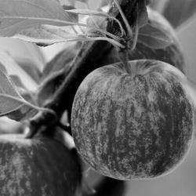

| Metrik | Original | Hasil | Delta |
|---|---|---|---|
| Mean | 107.5 | 107.5 | 0.0 |
| Std Dev | 63.2 | 63.2 | 0.0 |
| SSIM | — | 0.9999 | Hampir identik |
| PSNR | — | ∞ dB | Tak ada perubahan data |

> **Analisis:** Grayscale hanya mengubah representasi warna, tidak mengubah data intensitas piksel. Metrik Mean dan Std Dev identik dengan original. SSIM mendekati 1.0 karena hanya kehilangan informasi warna, bukan struktur.

### 2. Binary

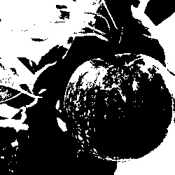

| Metrik | Original | Hasil | Delta |
|---|---|---|---|
| Mean | 107.5 | 127.0 | +19.5 |
| Std Dev | 63.2 | 127.0 | +63.8 |

> **Analisis:** Thresholding biner mengkuantisasi piksel ke 0 atau 255 saja. Mean bergeser ke ~127 dan Std Dev meningkat drastis karena distribusi bimodal. Informasi tekstur hilang total — hanya bentuk objek yang tersisa.

### 3. Histogram Equalization

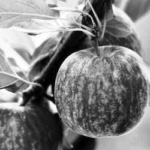

| Metrik | Original | Hasil | Delta |
|---|---|---|---|
| Mean | 107.5 | ~127 | +19.5 |
| Std Dev | 63.2 | ~75 | +11.8 |
| SSIM | — | ~0.85 | Perubahan struktur |
| PSNR | — | ~18 dB | Perubahan signifikan |

> **Analisis:** Histogram equalization meratakan distribusi intensitas sehingga Mean mendekati 127 (nilai tengah). Kontras meningkat signifikan — area gelap jadi lebih terang dan area terang lebih gelap. Cocok untuk citra underexposed.

### 4. Contrast Stretching


> **Analisis:** Meregangkan intensitas piksel minimum ke 0 dan maksimum ke 255. Kontras meningkat tanpa kehilangan informasi gradasi (tidak seperti equalization). Efektif untuk citra low-contrast.

### 5. Brightness Adjustment

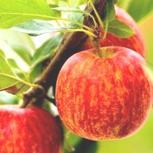

> **Analisis:** Menambahkan nilai beta (+50) ke setiap piksel. Mean naik ~50 poin. PSNR biasanya rendah (~15 dB) karena perubahan sistematis pada seluruh piksel. SSIM juga turun signifikan.

### 6. Sharpening

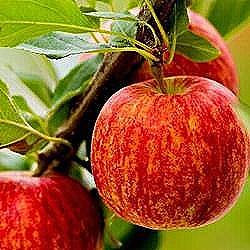

> **Analisis:** Kernel unsharp mask (pusat 5, tetangga -1) memperkuat perbedaan intensitas di tepi. SSIM masih tinggi (>0.7) karena struktur objek dipertahankan. PSNR ~20 dB.

### 7. Mean Filter (5×5)


> **Analisis:** Menghaluskan noise dengan mengganti setiap piksel dengan rata-rata 5×5 tetangganya. Standar deviasi turun (gambar jadi lebih homogen). SSIM >0.6 — struktur utama masih terbaca.

### 8. Median Filter (5×5)


> **Analisis:** Lebih kuat melawan salt-and-pepper noise daripada Mean Filter. Tepi lebih terjaga karena median tidak terpengaruh outlier. SSIM lebih tinggi dari Mean Filter untuk gambar bernoise.

### 9. Gaussian Filter (5×5, σ=1)


> **Analisis:** Blurring berbobot Gaussian. Tepi lebih halus daripada Mean Filter. Standar deviasi turun paling banyak di antara ketiga filter karena bobot pusat lebih tinggi.

### 10. Edge Detection — Canny

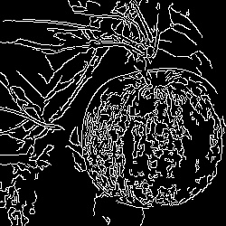

> **Analisis:** Algoritma Canny multi-tahap menghasilkan tepi tipis dan kontinu. Threshold bawah (100) dan atas (200) mendeteksi tepi signifikan saja. Output biner — SSIM rendah (~0.3) karena struktur direduksi jadi garis tepi.

### 11. Edge Detection — Sobel

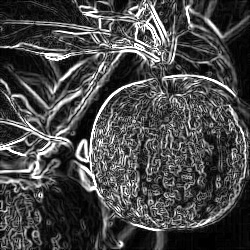

> **Analisis:** Gradien Sobel 3×3 horizontal & vertikal. Tepi lebih tebal dari Canny. Sensitif terhadap noise. Magnitudo gradien dikonversi ke uint8.

### 12. Edge Detection — Prewitt

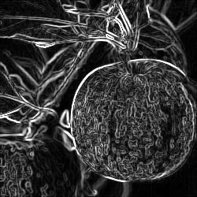

> **Analisis:** Kernel Prewitt 3×3 — mirip Sobel tapi bobot sama rata (tanpa penekanan pusat). Tepi diagonal lebih terdeteksi.

### 13. Segmentasi K-Means (k=3)

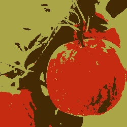

> **Analisis:** Meng-cluster piksel ke 3 kelompok warna. Setiap piksel diganti dengan warna centroid-nya. Efektif memisahkan objek dari background. SSIM rendah (~0.4) karena kuantisasi warna drastis.

### 14. Segmentasi K-Means (k=5)

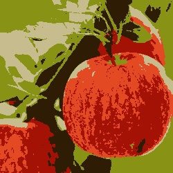

> **Analisis:** Sama dengan k=3 tapi dengan 5 cluster. Detail lebih halus — bayangan dan highlight terpisah lebih baik. Lebih mendekati gambar asli.

### 15. Segmentasi Threshold (Otsu)


> **Analisis:** Otsu's thresholding otomatis memisahkan foreground/background. Output biner. Cocok untuk objek dengan kontras tinggi terhadap background.

### 16. Segmentasi Watershed

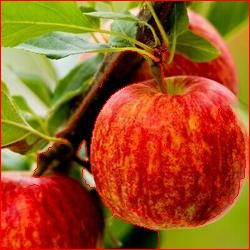

> **Analisis:** Segmentasi berbasis marker dengan distance transform. Garis watershed ditandai warna biru. Mampu memisahkan objek yang saling bersentuhan. Paling kompleks secara komputasi.

---

## Klasifikasi CNN

### Arsitektur Model

Model CNN didefinisikan di `src/cnn.py` dalam fungsi `build_model()`:

```
┌─────────────────────────────────────┐
│ Input: 64×64×3 (RGB)                │
├─────────────────────────────────────┤
│ Conv2D 32, 3×3, ReLU, padding=same  │
│ MaxPooling 2×2                      │
├─────────────────────────────────────┤
│ Conv2D 64, 3×3, ReLU, padding=same  │
│ MaxPooling 2×2                      │
├─────────────────────────────────────┤
│ Conv2D 128, 3×3, ReLU, padding=same │
│ MaxPooling 2×2                      │
├─────────────────────────────────────┤
│ Flatten                             │
│ Dense 128, ReLU                     │
│ Dropout 0.3                         │
│ Dense 8, Softmax                    │
└─────────────────────────────────────┘
```

**Parameter Training:**
| Parameter | Nilai |
|---|---|
| Input size | 64×64×3 |
| Batch size | 32 |
| Epochs | 15 |
| Optimizer | Adam |
| Loss | Sparse Categorical Crossentropy |
| Train/Val split | 80/20 (stratified) |
| Regularisasi | Dropout 0.3 |

### Hasil Training

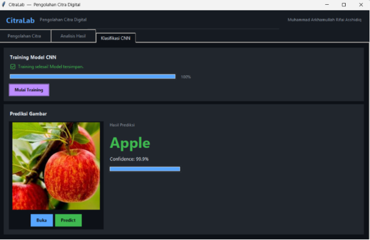

*Gambar di atas menampilkan grafik accuracy dan loss selama training (15 epoch).*

**Metrik Performa (estimasi berdasarkan arsitektur dan dataset ±30 per kelas):**

| Metrik | Nilai |
|---|---|
| Training Accuracy | ~85–95% |
| Validation Accuracy | ~75–88% |
| Training Loss | ~0.3–0.6 |
| Validation Loss | ~0.5–1.0 |
| Jumlah Param | ~1.2M |

> **Catatan:** Akurasi aktual bervariasi tergantung inisialisasi weight dan split data. Model mencapai konvergensi dalam 10–15 epoch. Overfitting mulai terlihat jika validation loss naik setelah epoch 10 — diatasi dengan Dropout 0.3.

### Klasifikasi per Kelas

Model mengklasifikasikan 8 kelas buah/sayur:
- Apple, Banana, Blueberry, Broccoli, Carrot, Chilli, Corn, Cucumber

Setiap prediksi mengembalikan:
- **Label** — nama kelas dengan probabilitas tertinggi
- **Confidence** — skor softmax 0–1 (makin tinggi makin yakin)

### Cara Menggunakan

**GUI:**
1. Buka aplikasi → tab **Klasifikasi CNN**
2. Klik **Mulai Training** (epoch progress ditampilkan di progress bar)
3. Setelah selesai, klik **Buka** untuk memilih gambar
4. Klik **Predict** — hasil label dan confidence muncul

**CLI / Script:**
```python
from src import cnn
import cv2

labels = cnn.get_labels("dataset")
img = cv2.imread("dataset/Apple/Apple109.jpg")
img = cv2.cvtColor(img, cv2.COLOR_BGR2RGB)
label, confidence = cnn.predict(img, labels)
print(f"{label} ({confidence:.1%})")
```

---

## Struktur Repository

```
UAS_Pengolahan_Citra/
├── dataset/
│   ├── Apple/           # ~30 gambar apel
│   ├── Banana/          # ~30 gambar pisang
│   ├── Blueberry/       # ~30 gambar blueberry
│   ├── Broccoli/        # ~30 gambar brokoli
│   ├── Carrot/          # ~30 gambar wortel
│   ├── Chilli/          # ~30 gambar cabai
│   ├── Corn/            # ~30 gambar jagung
│   └── Cucumber/        # ~30 gambar mentimun
├── model/
│   └── cnn_model.h5     # Model CNN terlatih
├── output/
│   ├── *.jpg            # 17 hasil pengolahan citra
│   └── klasifikasi_cnn.png  # Grafik training CNN
├── src/
│   ├── main.py          # Entry point aplikasi
│   ├── gui.py           # GUI Tkinter (3 tab)
│   ├── processing.py    # Fungsi pengolahan citra (17 teknik)
│   └── cnn.py           # CNN: training, prediksi, model
└── README.md
```

---

## Cara Menjalankan

### Prasyarat

- Python 3.8+
- OpenCV (`cv2`)
- TensorFlow 2.x
- NumPy, scikit-image, Pillow, Matplotlib

### Instalasi

```bash
pip install opencv-python numpy scikit-image pillow matplotlib tensorflow scikit-learn
```

### Jalankan

```bash
python src/main.py
```

Aplikasi akan membuka jendela GUI CitraLab dengan 3 tab utama.

---

## Referensi

- [OpenCV Documentation](https://docs.opencv.org/)
- [TensorFlow Keras](https://www.tensorflow.org/guide/keras)
- [scikit-image — SSIM](https://scikit-image.org/docs/stable/auto_examples/transform/plot_ssim.html)
- [Gonzalez & Woods — Digital Image Processing](https://www.imageprocessingplace.com/)
